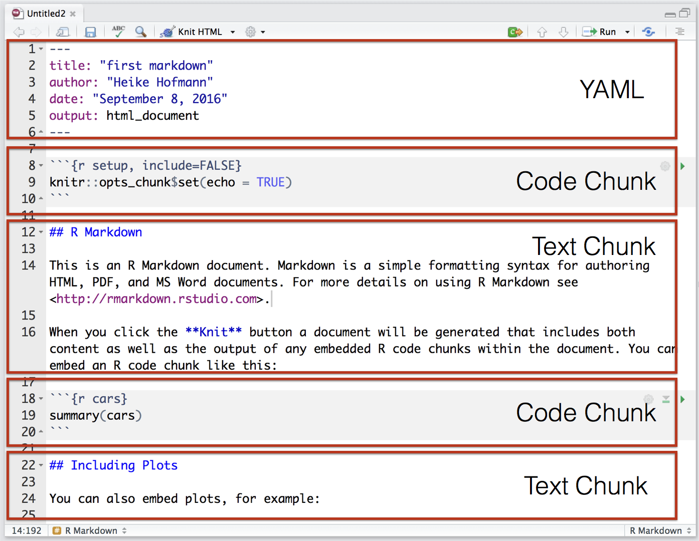

```{r setup, include=FALSE}
knitr::opts_chunk$set(echo = TRUE)
```

# R for Data Science

## We will talk about

- R
- R Markdown
- Git and Github
- Tidyverse package
    1. GGplot2 for graphs
    2. How to make maps (interactive)
- Web scrapping

# R, R studio and R Markdown

## R is ...

* __Free__ to use
* __Extensible__: 
    - Over 12,000 user contributed add-on packages currently on CRAN!
    - 12071 different packages available!
* __Powerful__: With the right tools, get more work done, faster.
* __Flexible__: Not a question of _can_, but _how_.
* __Frustrating__: Flexibility comes at a cost:
    - You need to truely understand what you are doing. 
    - Be careful about the errors in the packages.).


## RStudio is ... {.white}

[From Julie Lowndes](http://jules32.github.io/resources/RStudio_intro/):  

<!---  --->

<blockquote>
<p style="color:red"><b>If R were an airplane, RStudio would be the airport</b>, providing many, many supporting services that make it easier for you, the pilot, to take off and go to awesome places. Sure, you can fly an airplane without an airport, but having those runways and supporting infrastructure is a game-changer.</p>
</blockquote>


## The RStudio IDE


## The RStudio IDE


1. **Source editor:** Docking station for multiple files, Useful shortcuts ("Knit", "Run"), Highlighting/Tab-completion, Code-checking (R, HTML, JS), Debugging features  
2. **Console window:** Run the code, Highlighting/Tab-completion, Search recent commands
3. **Environment pane:** Working datasets/objects, Tools for package development, git, etc
4. **Other tabs/panes:** Graphics, R documentation, File system navigation/access


<p class = "note">
*Protip:* save yourself the headaches figuring out file paths and instead work in an RStudio R project (popup menu at the top left, change your working directory).
</p>

## Markdown

- Markdown is a particular type of **markup** language.
- Markup languages are designed to **produce documents from plain text**.
- Some of you may be familiar with **LaTeX**. This is another (less human friendly) markup language for creating pdf documents.
- LaTeX gives you much greater control, but it is restricted to pdf and has a much greater learning curve.
- **Markdown** is becoming a **standard**. Many websites will generate HTML from Markdown (e.g. GitHub, Stack Overflow, reddit, ...).

## Markdown is easy

```
*italic*
**bold**

# Header 1
## Header 2
### Header 3

- List item 1
- List item 2
    - item 2a
    - item 2b

1. Numbered list item 1
2. Numbered list item 2
    - item 2a
    - item 2b
```


Have a look at RStudio's [RMarkdown cheat sheet](https://www.rstudio.com/resources/cheatsheets/)

## What is RMarkdown?

- ... an authoring format that enables easy creation of dynamic documents, presentations, and reports from R. 
- it combines the core syntax of markdown with embedded R code chunks that are run so their output can be included in the final document.
- R Markdown documents are fully reproducible (they are automatically regenerated whenever underlying R code or data changes).

## {.white}




## Why R Markdown?

- **It's simple.** Focus on writing, rather than debugging silly errors.
- **It's flexible.** Markdown was created to simplify writing HTML, but thanks to pandoc, Markdown converts to many different formats!
- **It's dynamic.** Find a critical error? Get a new dataset? Regenerate your report without copy/paste hell!
- **Encourages transparency.** Collaborators (including your future self) will thank you for integrating your analysis & report.
- **Enables interactivity/reactivity.** Allow your audience to explore the analysis (rather than passively read it).

## {.white}


## Your Turn (5 min) {.white}


1. <span style="color:white">Open RStudio, create a new project.</span>
2. <span style="color:white">Create a new RMarkdown file and knit it.</span>
3. <span style="color:white">Navigate to the RMarkdown cheat sheet and download a copy (Google for the link!)</span>
3. <span style="color:white">Make changes to the markdown formatting and knit again.</span>
4. <span style="color:white">Export output to different files.</span>
5. <span style="color:white">If you feel adventurous, change some of the R code and knit again.</span>


# git and github

## Why git? What is git?

- **Git** is a *version control system* that was created to help developers manage collaborative software projects. Git tracks the evolution of a set of files, called a **repository** or **repo**. 
- This helps us
    - *merge* conflicts that arise from collaboration
    - *rollback* to previous versions of files as necessary
    - store *master* versions of files, no more `paper_final_final_I_really_mean_it.docx`

## How? ...Branching

<br>
<br>
<br>


## GitHub 

[GitHub](https://github.com) is one of many hosting services
(others are e.g. Bitbucket, GitLab, etc.). 


## Your Turn (5 min) 


This Your Turn is just a prep to get ready for the lab later. 
It'll take a couple of minutes of your time, but may need to wait for email confirmation from github ... 


Here goes: Do you have a github account? 

- No? Create a _free_ account at https://github.com/
- Yes? Then log into it. 
    - Do you remember your login and password?

## Git Terminology

from [github glossary](https://help.github.com/articles/github-glossary/)

- **Repository:** the basic element of git - like a project's folder. A repository contains all of the project files, and their __revision history__. One person owns a repository, multiple people can collaborate. Can be either public or private.
- **Remote:** This is the version of something that is hosted on a server. It can be (and usually is) connected to a local clone.
- **Clone:** A local copy of a repository that lives on your computer instead of on a website's server somewhere
- **Fork:** a remote copy of a repository stored under your account. Forks allow you to freely make changes to a project without affecting the original(master). 

## Terminology (cont'd)


- **Pull:** When you are fetching changes from the remote repository and merging them with your local clone. 
- **Commit:** A checkpoint for the local clone to save changes to a file (or set of files). Every time you commit, git creates a unique ID that allows you to keep record of what changes were made when and by who.
- **Push:** Sending your committed changes to the remote repository.


## Terminology (cont'd)


- **Pull Request:** Proposed changes to a repository submitted by a user and accepted or rejected by a repository's collaborators.
- **Issue:** Issues are suggested improvements, tasks or questions related to the repository. 


## Repositories

By default, all materials on GitHub are **public**. This is *good* because you are getting your work out there and contributing to the open source community! 

If you need **private** repos, checkout [GitHub for Education](https://education.github.com/) - free private repos for students/postdocs/professors.


## Resources

- Jenny Bryant's: Happy Git with R http://happygitwithr.com/
- Data Carpentry's tutorials: https://github.com/datacarpentry
- Reproducible Science Curriculum intitative: https://github.com/Reproducible-Science-Curriculum

# Welcome R

## Outline

- R is a calculator
- R functions, loop
- five commands to look at objects
- extracting pieces
- a first glimpse at data


## The R language

- Learning a new language: grammar, vocabulary
- Loading, examining, summarizing data
- Analyzing data
- Getting help
<!--- - Miscellaneous useful stuff --->


## {.white}


## Grammar

- Basic algebra is the same as calculator/mathematics
- explicit operators: `2*x` not `2x`,  `2^p` instead of $2^p$
- Applying a function is similar 
- Making a variable, use `<-` or `=`
- Everything in R is a vector

## Examples

<div class="double">
<p class="double-flow">
**Math** 

Assignments
$x = \frac{2}{3}$

Functions
$\sqrt{x}$

Vectors
$y = \left( 1, 2, 3, 5\right)^{\prime}$  

Indices
$y_1$

Mathematical Operators
$\sum_{i=1}^{4} y$

$2y$
</p><p class="double-flow">


**Code**

x <- 2/3 or x = 2/3

sqrt(x)

y = c(1,2,3,5)

y[1]

sum(y)

2*y

</p>
</div>


## Your Turn (5 min) {.white}


- <span style="color:white">Introduce vector $x$ defined as $x = (4, 1, 3, 9)^{\prime}$</span>
- <span style="color:white">Introduce vector $y$ defined as  $y = (1, 2, 3, 5)^{\prime}$</span>
- <span style="color:white">Calculate the Euclidean distance between the two vectors $x$ and $y$, defined as 
\[
d = \sqrt{\sum_{i=1}^4 (x_i - y_i)^2}
\]</span>
- <span style="color:white">What does a negative index do?</span>
- <span style="color:white">What happens if an index is repeated multiple times, i.e. what is `x[c(1,1,1,2,2,2,3,3,3)]`?</span>

```{r}
x = c(4, 1, 3, 9)
y = c(1, 2, 3, 5)
d = sqrt(sum((x - y)^2))

x
x[-2]
```

## Vocabulary 

- What verbs (=functions) do you need to know?
- Loading data
- Accessing parts of things
- calculation
- Statistical summaries
- ...

## R Reference Card

- Download the R Reference Card from http://cran.r-project.org/doc/contrib/Short-refcard.pdf
- Open/Print it so that you can glance at it while working

## R functions -- Define your own function

You have seen the build-in functions in R

- `sqrt()`
- `sum()`

How to build your own functions?

```{r}
q = function(x, y){
  q = x^2 + y^2
  return(q)
}

q(1, 2)
```

## General language

```
FunctionName = function(arg1, arg2, ...){
  ... ...
  return(...)
}
```

- `FunctionName` is chosen by your own
- `arg1`, `arg2` can be vectors or matrices
```{r}
q(c(1, 1), c(1, 2))
```
- `return(...)` is the final output of your function
- use the function: `FunctionName(arg1, arg2, ...)`

## Looping

```{r}
a = c(1 : 10)
b = c()

for (i in 1 : length(a)){
  b[i] = a[i]^2
  b[i]
  #print(b[i])
  #cat("Iteration = ", i, ", value =", b[i], "\n")
}

b
a^2
```

## Extract from a vector/matrix

```{r}
a = c(1, 3, 5, 7, 9)
a[3]
a[c(1, 2)]

A = matrix(c(1 : 9), 3, 3)
A
A[1, 2]
```

##

```{r}
A = matrix(c(1 : 9), 3, 3)
A
A[1, ]
A[, 1]
A[1 : 2, 2 : 3] #equivalent to A[c(1, 2), c(2, 3)]
```

## Your Turn (10 min) {.white}


- <span style="color:white">Write a function to calculate the variance of the data $X = (x_{1}, \ldots,  x_{n})^{\prime}$:
$$Var(X) = \frac{1}{n - 1}\sum_{i = 1}^{n}(x_{i} - \bar{x})^2  \ for \  \bar{x} = \frac{1}{n}\sum_{i = 1}^{n}x_{i}.$$</span>
- <span style="color:white">Evaluate your function on $X = (1, 2, \ldots, 10)^{\prime}$.</span>
- <span style="color:white">Try the R build-in function `var()`. Do you have the same result?</span>

```{r}
variance = function(x){
  # input x is a vector
  n = length(x)
  v = sum((x - mean(x))^2) / (n - 1)
  return(v)
}

x = c(1 : 10)
variance(x)
var(x) # var() is the built-in function for variance calculation in R

```

## Very basics

### Getting help within R

If you want to know what a specific `command` is doing:

```
?command
??command
help(command) 
help.search(command)
```

### Getting out

```
q()
```
Quits out of the console


## Loading class data

- Some R packages have in-built datasets
- For this class, there is an R package available on github 
- Installing/Updating `classdata` package (once every so often):
```{r, message=FALSE, results='hide'}
#devtools::install_github("heike/classdata")
```
- Make the data available (every time you start R):
```{r}
library(classdata)
```


## Your Turn (5 min) {.white}


<span style="color:white">Install the package `classdata` on your machine <br>
<span style="color:white">Make the package active in your current R session:
```{r}
library(classdata)
```
<span style="color:white">Check the R help on the dataset `cities`<br>
<span style="color:white">What happens if you just type in the name of the dataset?


## Inspecting objects

for object `x`, we can try out the following commands:

- ```x``` 
- ```head(x)```
- ```summary(x)```
- ```str(x)```
- ```dim(x)```


<font color="darkblue">Try these commands out for yourself on the `cities` data.</font>

## The `cities` data

- `cities` is a data frame with columns (variables) and rows (records)

```{r}
str(cities)
```

## Extracting parts of objects

For object `x`, we can extract parts in the following manner:

```
x$variable
x[, "variable"]
x[rows, columns]
x[1:5, 2:3]
x[c(1,5,6), c("State","Year")]
x$variable[rows]
```
`rows` and `columns` are vectors of indices.

For example, the codes in the same line give the same results:
```
cities$Population, cities[, "Population"], cities[, 2];
cities$City[c(2 : 10)], cities[c(2 : 10), "City"], cities[c(2 : 10), 1]
```

<font color="darkblue">Try these commands out for yourself on the `cities` data.</font>


## Statistical summaries

Elements of the five point summary: <br>
```mean, median, min, max, quartiles```<br>

Other summary statistics:<br>
```range, sd, var```<br>

Summaries of dependence between two variables:<br>
```cor, cov```

## Your turn {.white}


- <span style="color:white">Print and take a look at the first 10 data records of the `cities` data
- <span style="color:white">Compute mean and standard deviation for the number of burglaries. Why do you get NAs? (read `?NA`)
- <span style="color:white">Advanced:  Read `?mean` and `?sd`, and fix missing value problem

```{r}
library(classdata)
head(cities, 10)

mean(cities$Burglary)
sd(cities$Burglary)

mean(cities$Burglary, na.rm = TRUE)
sd(cities$Burglary, na.rm = TRUE)
```

## Data management in R: the tidyverse 


## `tidyverse`

`tidyverse` is a package bundling several other R packages:

- `ggplot2`, `dplyr`, `tidyr`, `purrr`, ...
- share common data representations and API, i.e. work well together
- see https://github.com/hadley/tidyverse for more information

Summaries

- numerical summaries - [elements]() of `dplyr` and `tidyr`
- graphical summaries - [visualizations]() with `ggplot2`


# GGplot2

## Data Exploration

- asking good questions is important for any data exploration: "your data won't speak unless you ask the right questions"
- a data exploration is a cycle of asking questions, looking at the answers, and deriving new questions from them
- for a sound exploration: start by checking individual variables, then move on to higher dimensions

```{r}
library(classdata)
head(fbiwide)
```


## Plan for answers

- Explore how one (or more) variables are distributed: *barchart or histogram*
- Explore how two variables are related:  *scatterplot, boxplot, tile plot*
- Explore how two variables are related, conditioned on other variables: *faceting, color & other aesthetics*


We will be using the `ggplot2` framework for plotting

```{r}
library(ggplot2)
```


## Why `ggplot2`

- Wildly popular package for statistical graphics: over 2.5 million downloads from CRAN in 2017 (several thousand times per day)
- Developed by Hadley Wickham (An ISU Alumni)
- Designed to adhere to good graphical practices
- Constructs plots using the concept of layers
- Supports a wide variety plot types and extensions
- Ported to different languages, e.g. `ggpy`
\medskip
- http://ggplot2.org/book/ or Hadley's book *ggplot2: Elegant Graphics for Data Analysis* for reference 


## `ggplot` Function

The `ggplot` function is the basic workhorse of ggplot2

- Produces all plot types available with ggplot2
- Allows for plotting options within the function statement
- Creates an object that can be saved
- Plot layers can be added to modify plot complexity

## `ggplot` Structure

The `ggplot` function has the basic syntax:

`ggplot(data, mappings) + geom_type(options)`

- data: dataset to be used
- mappings: determines which variables are connected to which plot elements, mappings are done with `aes()`
- type: determines type of the plot, e.g. `point`, `line`, `bar`
- options: there are so, so many options!

## Scatterplots in `ggplot2`

`aes` allows us to specify mappings; scatterplots need a mapping for `x` and a mapping for `y`:

```{r, fig.width=3.5, fig.height=3.5}
ggplot(data = fbiwide, aes(x = Burglary, y = Murder)) +
  geom_point()
```  

## Your turn {.white}


- <span style="color:white">Draw a scatterplot of the number of burglaries by murders.</span>
- <span style="color:white">Adjust the numbers of the above scatterplot to show log transformed numbers. How can we interpret the numbers on the axes?</span>
- <span style="color:white">Draw a scatterplot of the log transformed number of burglaries by motor vehicle thefts.</span>

```{r, echo = FALSE, eval = FALSE}
ggplot(data = fbiwide, aes(x = log(Burglary), y = log(Murder))) +
  geom_point()

ggplot(data = fbiwide, aes(x = log(Burglary), y = log(Motor.vehicle.theft))) +
  geom_point()
```  

## Revision - Interpreting Scatterplots

- Big patterns
    - Form and direction
    - Strength
- Small patterns
- Deviations from the pattern
    - Outliers
    

## Aesthetics

Can map other variables to size, colour, shape, ....

```{r, fig.width=3.5, fig.height=3.5}
ggplot(aes(x = log(Burglary), y = log(Motor.vehicle.theft),
           colour=Year), data=fbiwide) + geom_point()
```           

## Your turn {.white}


- <span style="color:white">Draw a scatterplot of the log transformed number of burglaries by motor vehicle thefts. Map the state variable to colour. Why is this a terrible idea?</span>
- <span style="color:white">Draw a scatterplot of the log transformed number of burglaries by motor vehicle thefts. Map Population to size. How do we interpret the output?</span>
- <span style="color:white">Which other aesthetics are there? Have a look at the [RStudio cheat sheet on visualization](https://www.rstudio.com/resources/cheatsheets/) </span>

<span style="color:white">**Stretch goal**: Draw a histogram of the state populations. </span>

```{r, echo = FALSE, eval = FALSE}
ggplot(data = fbiwide, aes(x = log(Burglary), y = log(Motor.vehicle.theft), colour = Year)) + geom_point()

ggplot(data = fbiwide, aes(x = log(Burglary), y = log(Motor.vehicle.theft), colour = State)) + geom_point()

ggplot(data = fbiwide, aes(x = log(Burglary), y = log(Motor.vehicle.theft), size = Population)) + geom_point() 

ggplot(data = fbiwide, aes(Population)) + geom_histogram()
ggplot(data = fbiwide, aes(Population)) + geom_histogram() + facet_wrap(~ State)
```  


## Your turn {.white}


- <span style="color:white">Compare the log transformed number of burglaries by motor vehicle thefts over years. How to make a nice plot?</span>
- <span style="color:white">Compare the log transformed number of burglaries by motor vehicle thefts over States, coloured by years.</span>
- <span style="color:white">Now, only focus on comparing California, Colorado, Iowa, Illinois, District of Columbia and New York. </span>
- <span style="color:white">We all know population is an important factor. How to compare different states by standardized population? </span>

```{r, echo = FALSE, eval = FALSE}
fbiwide1 = fbiwide[fbiwide$Year %in% c(1961, 1971, 1981, 1991, 2001, 2011), ]
ggplot(data = fbiwide1, aes(x = log(Burglary), y = log(Motor.vehicle.theft), size = Population)) +
  geom_point() + facet_grid(. ~ Year)

ggplot(data = fbiwide, aes(x = log(Burglary), y = log(Motor.vehicle.theft), colour = Year)) + 
  geom_point() + facet_wrap(~ State)

fbiwide2 = fbiwide[fbiwide$State %in% c("California", "Colorado", "Iowa", "Illinois", "District of Columbia", "New York"), ]
fbiwide2$State_f = factor(fbiwide2$State, levels=c("California", "Colorado", "Iowa", "Illinois", "District of Columbia", "New York"))
ggplot(data = fbiwide2, aes(x = log(Burglary), y = log(Motor.vehicle.theft), colour = Year)) + 
  geom_point() + facet_grid(. ~ State_f)
ggplot(data = fbiwide2, aes(x = log(Burglary), y = log(Motor.vehicle.theft), colour = Year, size = Population)) + 
  geom_point() + facet_grid(. ~ State_f)
ggplot(data = fbiwide2, aes(x = log(Burglary / Population), y = log(Motor.vehicle.theft / Population), colour = Year)) + 
  geom_point() + facet_grid(. ~ State_f)
```  

## Facetting

Can facet to display plots for different subsets:

`facet_wrap`, `facet_grid`

```{r, message=FALSE}
ggplot(aes(x = Year, y = Murder), data=fbiwide) +
  facet_wrap(~State, scale = "free_y") + 
  geom_point()
```

## Setup of `facet_wrap` and `facet_grid`

- `facet_grid` has formula specification: `rows ~ cols`
- `facet_wrap` has specification `~ variables` 
- multiple variables (in either specification) are included in form of a sum, i.e. `rowvar1 + rowvar2 ~ colvar1+ colvar2`
- no variable (in `facet_grid`) is written as `.`, i.e. `rowvar ~ .` are plots in a single column.

## Your turn {.white}


Use the `fbiwide` data from the package `classdata` for this your turn.

- <span style="color:white">Plot the number of car thefts by year for each state (facet by state).</font>
- <span style="color:white">The numbers are dominated by the number of thefts in California, New York, and Texas. Use a log-scale for the y-axis. Does that help?</font>
- <span style="color:white">Another approach to fix the domination by CA, TX and NY: Read up on the parameters in `facet_wrap` to find a way to give each panel its own scale. Comment on the difference in the results.</font>

```{r, echo=FALSE, eval = FALSE}
ggplot(aes(x = Year, y = Motor.vehicle.theft), data=fbiwide) +
  facet_wrap(~State) +
  geom_point()

ggplot(aes(x = Year, y = log(Motor.vehicle.theft)), data=fbiwide) +
  facet_wrap(~State) +
  geom_point()

ggplot(aes(x = Year, y = Murder), data=fbiwide) +
  facet_wrap(~State, scales = "free_y") +
  geom_point()
```

## Facets vs aesthetics?

- Will need to experiment as to which one answers your question/tells the story best
- Rule of thumb: 
    - aesthetics: explore relationship
    - Facets: comparison

## Boxplots

```{r, echo=FALSE, warning=FALSE, fig.width = 8, fig.height = 5}
ggplot(data = fbi, aes(x = Type, y = log10(Count))) + geom_boxplot() + coord_flip()
```

## Boxplot definition

- definition by J.W. Tukey (1960s, EDA 1977)


## Boxplots

- are used for group comparisons and outlier identifications
- usually only make sense in form of side-by-side boxplots.
- `geom_boxplot` in ggplot2 needs `x` and `y` variable (`y` is measurement, `x` is categorical)

```{r, eval=FALSE}
ggplot(data = fbi, aes(x = Type, y = log10(Count))) +
  geom_boxplot() + 
  coord_flip()
```

## Your turn {.white}


- <span style="color:white">Using ggplot2, draw side-by-side boxplots of the number of robberies by state. Use a log transformation on y and compare results.</font>
- <span style="color:white">**Stretch goal:** Compare rates of robberies by state, i.e. adjust robberies by the state population. Then plot side-by-side boxplots. </font>

```{r}
fbi1 = fbi[fbi$Type == "Robbery", ]
ggplot(data = fbi1, aes(x = State, y = Count)) +
  geom_boxplot() + 
  coord_flip()

ggplot(data = fbi1, aes(x = State, y = log(Count))) +
  geom_boxplot() + 
  coord_flip()

ggplot(data = fbi1, aes(x = State, y = Count / Population)) +
  geom_boxplot() + 
  coord_flip()
```

## Boxplots - Pros and Cons

- **Pros:**
    - Symmetry vs Skewness
    - Outliers
    - Quick Summary
    - Comparisons across multiple Treatments (side by side boxplots)
- **Cons:**
    - Boxplots hide multiple modes and gaps in the data
    - Boxplots cannot tell the detail distribution of the data

## Univariate plots

Histograms: 

```{r, fig.width=4, fig.height=3}
ggplot(fbiwide, aes(x = Motor.vehicle.theft)) + 
  geom_histogram(binwidth=5000) +
  ggtitle("binwidth = 5000")
```

## Univariate plots

Histograms: 

```{r, fig.width=4, fig.height=3}
ggplot(fbiwide, aes(x = Motor.vehicle.theft)) + 
  geom_histogram(binwidth=1000) +
  ggtitle("binwidth = 1000")
```


## Barchart

```{r}
ggplot(fbi, aes(x = Type)) + 
  geom_bar(aes(weight= Count)) +
  coord_flip()
```


## Histograms and barcharts

What do we look for?

- Symmetry/Skewness
- Modes, Groups  (big pattern: where is the bulk of the data?)
- Gaps & Outliers (deviation from the big pattern: where are the other points?)


For the histogram, always choose the binwidth consciously

In a barchart, choose the order of the categories consciously (later)

## Your turn {.white}


- <span style="color:white">Use the `fbi` data set to draw a barchart of the variable `Violent Crime`. Make the height of the bars dependent on the number of reports (use `weight`). Then facet by type (does the result match your expectation? good! get rid of facetting). Color bars by `Type`. </font>
- <span style="color:white">Use the `fbi` data set to draw a histogram of the number of reports. Facet by type, make sure to use individual scales for the panels. </font>

```{r, echo=FALSE, eval = FALSE}
ggplot(aes(x = Violent.crime), data=fbi) +
  #facet_wrap(~Type) +
  geom_bar(aes(weight= Count, fill = Type)) +
  #geom_bar(aes(weight= Count, fill = Type), colour = "black") +
  coord_flip()

ggplot(aes(x = Count), data = fbi) + geom_histogram() +
  facet_wrap(~Type, scales = "free")

head(fbiwide)
head(fbi)

fbi.self = c()
for (i in 1 : 9){
  count = fbiwide[, (i + 5)]
  temp1 = cbind(fbiwide[, c(1 : 4)], count)
  fbi.self = rbind(fbi.self, temp1)
}

CrimeNames = names(fbiwide)[6 : 14]
fbi.self$Type = rep(CrimeNames, each = dim(fbiwide)[1])
```

## More on `ggplot2`

- reference/document: http://ggplot2.tidyverse.org/reference/
- RStudio cheat sheet for [ggplot2](https://www.rstudio.com/wp-content/uploads/2015/03/ggplot2-cheatsheet.pdf)
- ggplot2 mailing list: 
https://groups.google.com/forum/?fromgroups#!forum/ggplot2

# Polishing plots

## Outline

- color choices
- themes

## `ggplot2` provides defaults ...

- but every aspect of the plot can be changed
- colors are controlled through **scales**
- **themes** control presentation of non-data elements

# Colors

## Color Scales

default continuous colour scheme

```{r, message = FALSE, fig.height =4}
library(tidyverse)
p1 <- mpg %>% filter(year == 2008) %>%
  ggplot(aes(x = cty, y = hwy, colour = cyl)) +
  geom_point()
```


```{r, fig.height =4}
p1 + scale_colour_continuous()
```

## Color Scales

default discrete colour scheme

```{r, message = FALSE, fig.height =4}
p2 <- mpg %>% filter(year == 2008) %>%
  ggplot(aes(x = cty, y = hwy, colour = factor(cyl))) +
  geom_point()
```


```{r, fig.height =4}
p2 + scale_colour_discrete()
```

## Color Scales

- Colors are controlled through scales
`scale_colour_discrete` (`scale_colour_hue`) and `scale_colour_continuous` (`scale_colour_gradient`) are the default choices for factor variables and numeric variables
- we can change parameters of the default scale, or we can change
the scale function

## Colour gradients

`scale_colour_gradient (..., low = "#132B43", high = "#56B1F7", space = "Lab", na.value = "grey50", guide = “colourbar")`

- colors can be specified by hex code, name or through rgb()
- gradient goes from low to high - that should match the interpretation of the mapped variable


## Colour gradients - divergent scheme

`scale_colour_gradient2(..., low = muted("red"), mid = "white",  
high = muted("blue"), midpoint = 0, space = "Lab", na.value = "grey50",  guide = "colourbar")`

- midpoint is value of the ‘neutral’ color gradient2 is a divergent color scheme
- best matches a variable that goes from large negative to zero to large positive (or below mean, above mean)


## Discrete color schemes

`scale_color_hue (..., h = c(0, 360) + 15, c = 100, l = 65, h.start = 0, direction = 1, na.value = "grey50")`

- uses hue, chroma and luminance (=value)
- each level of a variable is assigned a different level of h


## Discrete color schemes - Brewer

`scale_colour_brewer(..., type = "seq", palette = 1, direction = 1)`

- brewer schemes are defined in RColorBrewer (Neuwirth, 2014) palettes can be specified by name or index
- see also http://colorbrewer2.org/ (Brewer et al 2002)

## All brewer schemes

```{r, fig.height=6}
library(RColorBrewer)
display.brewer.all()
```

## Color and Fill

- Area geoms (barcharts, histograms, polygons) use `fill` to map values to the fill color
- continuous color scales: `scale_fill_gradient`, `scale_fill_gradient2`, ...
- discrete color scales:  `scale_fill_hue`, `scale_fill_brewer`, `scale_fill_grey`, ...


# Themes

## Themes

- Themes allow to control every aspect of non-data related aspects of a plot 
- Several pre-defined themes: `theme_grey` (default), `theme_bw`, `theme_light`, `theme_dark`
- Use `theme_set` if you want it to apply a theme to every future plot, e.g. `theme_set(theme_bw())`
- `ggthemes` package defines additional themes: 
`library(help = "ggthemes")` lists all themes

## Example

```{r}
p <- mpg %>% ggplot(aes(x = displ, y =  cty, colour= factor(class))) + geom_point()
```

<p class="double">
```{r, fig.width = 4, fig.height = 2}
p + theme_grey()
```
```{r, fig.width = 4, fig.height = 2}
p + theme_bw()
```
</p>

## Example - more themes

```{r}
p <- mtcars %>% ggplot(aes(x = wt, y =  mpg, colour= factor(cyl))) + geom_point()
```

<p class="double">
```{r, fig.width = 4, fig.height = 2}
p + theme_light()
```
```{r, fig.width = 4, fig.height = 2}
p + theme_dark()
```

</p>

## More themes

```{r}
library(ggthemes)
```

<p class="double">
```{r, fig.width = 4, fig.height = 2}
p + theme_excel() 
```
```{r, fig.width = 4, fig.height = 2}
p + theme_fivethirtyeight()
```

</p>

## Elements

- You can also make your own theme, or modify an existing.
- Themes are made up of elements which can be one of:
`element_line`,  `element_text`, `element_rect`,
`element_blank`
- Gives you a lot of control over plot appearance.

## Elements of themes

- Axis:  
  `axis.line`, `axis.text.x`, `axis.text.y`, `axis.ticks`, `axis.title.x`, `axis.title.y`
- Legend:  
`legend.background`, `legend.key`, `legend.text`, `legend.title`
- Panel:  
`panel.background`, `panel.border`, `panel.grid.major`, `panel.grid.minor`
- Strip (facetting):  
`strip.background`, `strip.text.x`, `strip.text.y`

for a complete overview see `?theme`


## Changing elements manually

- to change an element add the theme function and specify inside:
- example:

```{r, fig.width = 4, fig.height = 4}
mpg %>% ggplot(aes(x = manufacturer)) + geom_bar() +
  theme(axis.text.x = element_text(angle=45, vjust=1, hjust=1))
```    

# Drawing maps

## Outline

- package `maps`
- what is a map
- maps and map data in ggplot
- drawing choropleth maps

## Maps are ...


<div class="double">
<p class="double-flow">
- ... points in latitude and longitude

```{r, echo=FALSE, warning = FALSE, message=FALSE, fig.width=3, fig.height = 2}
library(ggplot2)
iowa <- map_data("state") %>% filter(region=="iowa")
iowa %>% ggplot(aes(x = long, y = lat)) + geom_point()
```
</p><p class="double-flow">
- that are connected in the 'right' order (determined by order in the data frame)

```{r, echo=FALSE, warning = FALSE, message=FALSE, fig.width=3, fig.height = 2}
library(ggplot2)
iowa <- map_data("state") %>% filter(region=="iowa")
iowa %>% ggplot(aes(x = long, y = lat)) + geom_point() + geom_path()
```
</p>
</div>

## Maps ...


<div class="double">
<p class="double-flow">
- use  `group` parameter to distinguish between different regions

```{r, echo=FALSE, warning = FALSE, message=FALSE, fig.width=3, fig.height = 4}
iowa <- map_data("state") %>% filter(region %in% c("iowa", "florida"))
iowa %>% ggplot(aes(x = long, y = lat)) + geom_path(aes(group=region))
```
</p><p class="double-flow">
- are usually filled in

```{r, echo=FALSE, warning = FALSE, message=FALSE, fig.width=3, fig.height = 4}
iowa <- map_data("state") %>% filter(region %in% c("iowa", "florida"))
iowa %>% ggplot(aes(x = long, y = lat)) + geom_polygon(aes(group=region))
```

</p>
</div>

## map data

```{r}
states <- map_data("state")
head(states)
```

## Maps in code (1)


```{r,  warning = FALSE, message=FALSE, fig.width=8, fig.height = 5}
states %>% ggplot(aes(x = long, y = lat)) + geom_point()
```

## Maps in code (2)


```{r,  warning = FALSE, message=FALSE, fig.width=8, fig.height = 5}
states %>% ggplot(aes(x = long, y = lat)) + geom_path(aes(group = group))
```

## Maps in code (3)

```{r, warning = FALSE, message=FALSE, fig.width=8, fig.height = 5}
states %>% ggplot(aes(x = long, y = lat)) + geom_polygon(aes(group = group))
```

## Maps in code (4)

```{r, warning = FALSE, message=FALSE, fig.width=8, fig.height = 5}
states %>% ggplot(aes(x = long, y = lat)) + geom_polygon(aes(group = group, fill=lat))
```


## Your Turn (6 mins) {.white}


- <span style="color:white">Use ggplot2 and pull out map data for all
US counties: ```counties <- map_data("county")```
</span>
- <span style="color:white">Draw a map of counties (polygons & path geom)
</span>
- <span style="color:white">Colour all counties called "story"
</span>
- <span style="color:white">Advanced: What county names are used often?
</span>

```{r, warning = FALSE, message=FALSE, fig.width=8, fig.height = 5}
counties <- map_data("county")
counties %>% ggplot(aes(x = long, y = lat)) + geom_path(aes(group = group))
counties %>% ggplot(aes(x = long, y = lat)) + geom_polygon(aes(group = group))

counties$Story = (counties$subregion == "story") 
counties %>% ggplot(aes(x = long, y = lat, fill = Story)) + geom_polygon(aes(group = group))

counties %>% group_by(region, subregion) %>% count() %>% group_by(subregion) %>% count() %>% arrange(desc(nn))
```

## Choropleth maps

- choropleth maps are thematic maps: areas are shaded in proportion to the values of a variable
- join datasets: content and map

## Join content and map 

Content:
```{r}
data(fbi, package="classdata")
fbi14 <- fbi %>% filter(Year == 2014)
head(fbi14)
```

## Join content and map

Map:
```{r}
head(states)
```

## Prepare for join

- combine fbi and states by state name, but we need to make the spelling the same
- for simplification, introduce new variable with all lower case letters
- generally, content data is more important, but we will see missing states on the map: `anti_join`

```{r}
fbi14$region <- tolower(fbi14$State)

nomatch1 <- fbi14 %>% anti_join(states, by="region")
# States for which we do not have map data
unique(nomatch1$State)


nomatch2 <- states %>% anti_join(fbi14, by="region")
# States for which we do not have crime data
unique(nomatch2$State)
```

## Join and Map

```{r, fig.width=9, fig.height = 4.5}
fbi.map <- fbi14 %>% left_join(states, by="region")
fbi.map %>% filter(Type=="Burglary") %>% 
  ggplot(aes(x = long, y = lat, fill=Count/Population*70000)) +
  geom_polygon(aes(group=group))
```

## Your Turn  {.white}


- <span style="color:white">Draw a choropleth map of the rate of motor vehicle thefts in 2012 across the US.
</span>
- <span style="color:white">`scale_fill_gradient2` allows you to set a color scheme with two main colors. Read up on it and change the scheme in the first choropleth map.
</span>

```{r, fig.width=9, fig.height = 4.5}
fbi12 <- fbi %>% filter(Year == 2012)
fbi12$region <- tolower(fbi12$State)

fbi.map12 <- fbi12 %>% left_join(states, by="region")
fbi.map12 %>% filter(Type=="Motor.vehicle.theft") %>% 
  ggplot(aes(x = long, y = lat, fill=Count/Population*70000)) +
  geom_polygon(aes(group=group)) + 
  scale_fill_gradient2()
```

## Geographic data in layers

- For data collected with GPS coordinates we can use maps as background layers
- e.g. campaign expenditures
- In that situation, we do not need to join the map information and the content data, but use layers with separate data sets of the form

```
map %>% ggplot(aes(x = long, y = lat)) + 
  geom_polygon(aes(group = group)) +
  geom_point(aes(x=longitude, y = latitude), data = content) 
```

## FARS data

- US Department of transportation is keeping a record of every accident that results in a fatality in the FARS Data base (fatal accident report system, http://www.nhtsa.gov/FARS)
- FARS consists of 20+ tables consisting of various aspects of each accident
Documentation at
- https://www-fars.nhtsa.dot.gov/Main/index.aspx
- three of the main tables are `accident`, `person`, and `vehicle`

## Data 

- Data of all accidents are available at:

```{r}
acc <- read.csv("https://raw.githubusercontent.com/DS202-at-ISU/labs/master/data/fars2016/accident.csv", stringsAsFactors = FALSE)
names(acc)
```

## Your Turn  {.white}


- <span style="color:white">Use the accident data to plot the geographic location of all accidents in the US in 2016.
</span>
- <span style="color:white"> Plot accidents on a map of the US (use the map of the US as first layer)
</span>
- <span style="color:white">Why would it be tricky to plot a choropleth map of the number of accidents by state?
</span>

```{r}
acc %>% filter(YEAR == 2016, LONGITUD < 0) %>% ggplot(aes(x = LONGITUD, y = LATITUDE)) + geom_point()

states %>% ggplot(aes(x = long, y = lat)) + 
  geom_path(aes(group = group)) +
  geom_point(aes(x = LONGITUD, y = LATITUDE), size = 0.05, color = 'red', data = acc %>% filter(YEAR == 2016, LONGITUD < 0, LONGITUD > -130)) 

states %>% ggplot(aes(x = long, y = lat)) + 
  geom_path(aes(group = group)) +
  geom_point(aes(x = LONGITUD, y = LATITUDE), size = 0.05, color = 'red', data = acc %>% filter(YEAR == 2016, LONGITUD < 0, LONGITUD > -130, DRUNK_DR == 1)) + 
  geom_point(aes(x = LONGITUD, y = LATITUDE), size = 0.05, color = 'blue', data = acc %>% filter(YEAR == 2016, LONGITUD < 0, LONGITUD > -130, DRUNK_DR == 0))
```


# Web Scraping with R


## The `rvest` package

`read_html` gets *all* the information from a URL

```{r warning = FALSE, message = FALSE}
library(rvest)
url <- "https://www.the-numbers.com/weekend-box-office-chart"
html <- read_html(url)
html
```

## Get a *table* from an online source

`html_table` extracts all tables from the sourced html into a list of data frames:

```{r}
tables <- html %>% html_table(fill=TRUE)
length(tables)
```
## Lists

- are most general form of objects in R
- `length()` accesses the number of items in a list
- `[[ ]]` accesses each item

```{r}
dim(tables[[1]])
dim(tables[[2]])

head(tables[[2]])
```

##

Most tables need a bit of clean-up:

```{r}
names(tables[[2]])

names(tables[[2]])[1:2] <- c("Rank", "Rank.Last.Week")
str(tables[[2]])
box <- tables[[2]] %>% mutate(
  Gross = parse_number(Gross),
  Thtrs. = parse_number(Thtrs.)
)
head(box)
```

## Your Turn (6 mins) {.white}


<span style="color:white">Connect to the The-Numbers website for weekly boxoffice gross at https://www.the-numbers.com/weekend-box-office-chart
</span>

- <span style="color:white">Pick the week that you were last in the movies.
</span>
- <span style="color:white">Use `rvest` to download the box office gross in that week.
</span>
- <span style="color:white">Clean up the data (name all the variables, numbers should be numbers).
</span>

## Beyond tables

Sometimes data on the web is not structured as nicely ... e.g. let's assume we want to get a list of all recently active baseball players from [Baseball reference](http://www.baseball-reference.com/players/)

## Cascading Style Sheets (CSS)

- [css](https://en.wikipedia.org/wiki/Cascading_Style_Sheets) is a language that describes the style of an HTML document.


- Example: (https://www.w3schools.com/css/tryit.asp?filename=trycss_default)
- play [the game](http://flukeout.github.io/)

## SelectorGadget

- SelectorGadget is a javascript bookmarklet to determine the [css](https://en.wikipedia.org/wiki/Cascading_Style_Sheets) selectors of pieces of a website we want to extract.
- Read up on the [SelectorGadget](http://selectorgadget.com/) link: install it for your machine by installing the Chrome extension, then click on it to use it.
- When SelectorGadget is active, pieces of the website are highlighted in orange/green/red.
- Use SelectorGadget on http://www.baseball-reference.com/players/.
- read more details on `vignette("selectorgadget")`

## SelectorGadget Result

```{r}
url <- "http://www.baseball-reference.com/players/a/"
html <- read_html(url)
html %>% html_nodes("#div_players_ a") %>% head()
```

## Example

We want to get access to pieces of the links:

`html_text` allows us to get text out, `html_attr` let's us access an attribute of an html node, `html_attrs` extracts all attributes of an html node:


```{r}
html %>% html_nodes("#div_players_ a") %>% html_text() %>% head()
html %>% html_nodes("#div_players_ a") %>% html_attr(name="href") %>% head()
```


## How to use the href?

```{r}
h1 = html %>% html_nodes("#div_players_ a") %>% html_attr(name="href")
length(h1)
h1[1]

h0 = "http://www.baseball-reference.com"
url.player = paste(h0, h1[1], sep = "")
url.player
```

## Your Turn {.white}


<span style="color:white">Use the SelectorGadget on the website for [David Aardsma](http://www.baseball-reference.com/players/a/aardsda01.shtml)
</span>

- <span style="color:white">Find the css description to extract his career statistics and load them into your R session.
</span>
- <span style="color:white">Does the same code work to extract career statistics for (some of) the other players?
</span>
- <span style="color:white">What other information do we need to know? and how can we get to that?
</span>

## Your Turn  - Solution

```{r}
url <- "http://www.baseball-reference.com/players/a/aardsda01.shtml"
html <- read_html(url)
# good first start, but not good for further processing
h2 = html %>% html_nodes(".stats_pullout p , h4")

h3 = html %>% html_nodes(".p3 p , .p2 p , .p1 p , .stats_pullout strong , h4")
```

## Your Turn  - Solution (2)

```{r}
# better: pull out individual vectors
html %>% html_nodes("h4") %>% html_text()
html %>% html_nodes(".stats_pullout p") %>% html_text() 
```


